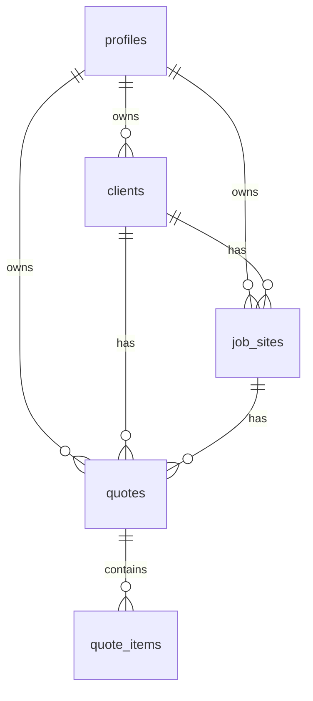

# CRM Artisan — Project Overview

A lightweight CRM for independent tradespeople to manage clients, job sites, and quotes from a single interface.

---

## Problem

Independent tradespeople (plumbers, electricians, carpenters) manage client relationships, job sites, and quotes through a mix of paper, phone notes, and generic tools not built for their workflow. This causes missed quotes, lost client details, and no clear view of monthly earnings.

---

## Target Users

| User                    | Need                                                                    |
| ----------------------- | ----------------------------------------------------------------------- |
| Solo tradesperson       | Quick quote creation on a phone between jobs; dashboard view of the day |
| Small-team tradesperson | Manage multiple active job sites and a client list across a team        |

**Primary persona:** Independent plumber, aged 35–55, one helper. Not comfortable with digital tools — prefers simple, obvious UI. Uses a mid-range Android phone (~$300) on site. Needs ≤ a few taps for common tasks on a small screen and a modest connection.

### Daily Scenarios

| Time    | Scenario                                                                 |
| ------- | ------------------------------------------------------------------------ |
| Morning | Opens app, sees today's active job sites on the dashboard                |
| Midday  | Client calls for a quote — creates it in a few taps between appointments |
| Evening | Reviews and downloads PDF quotes to send to clients                      |
| Sunday  | Checks monthly revenue on the dashboard                                  |

---

## Tech Stack

| Layer     | Technology                                                                            |
| --------- | ------------------------------------------------------------------------------------- |
| Framework | [Next.js 16](https://nextjs.org/docs) / [React 19](https://react.dev)                 |
| Language  | [TypeScript](https://www.typescriptlang.org/docs/)                                    |
| Database  | [Supabase](https://supabase.com/docs) (PostgreSQL + Row-Level Security)               |
| ORM       | [Drizzle ORM](https://orm.drizzle.team/docs/overview) + drizzle-kit                   |
| Auth      | Email + password via [Supabase Auth](https://supabase.com/docs/guides/auth)           |
| CSS       | [Tailwind CSS v4](https://tailwindcss.com/docs) + [ShadCN UI](https://ui.shadcn.com/) |
| Icons     | [Lucide React](https://lucide.dev/icons/)                                             |
| Payments  | [Stripe](https://stripe.com/docs) — subscription checkout                             |
| PDF       | Rendered `/pdf` route — browser print or headless download                            |

> **Tailwind rule**: No `tailwind.config.ts` — theme is defined via `@theme inline` in `globals.css`.
> **Component rule**: `src/components/ui/` is ShadCN-only. Custom components go in `src/components/`.
> **Next.js rule**: Read `node_modules/next/dist/docs/` before writing Next.js code — v16 has breaking changes.

---

## Features

### 1. Clients

Manage the people who hire you.

- **Data:** name, company (optional), phone (required), email (required), address, notes, created/updated dates
- **Actions:** create, view, edit, delete; view all linked job sites and quotes
- **List:** search by name or company; paginated (`PAGE_SIZE`)
- **Edge cases:** phone + email both required; deleting a client cascades to job sites and quotes; empty state (no jobs/quotes) shows placeholder, not error

### 2. Job Sites

A physical location where work is performed. A client can have multiple job sites.

- **Data:** title, address, start date, end date (optional), status (Planned / In Progress / Completed), linked client
- **Actions:** create, view, edit, delete; view linked quotes
- **List:** filter by client, filter by status; paginated (`PAGE_SIZE`)
- **Edge cases:** end date optional; deleting cascades to quotes; all sites count toward free-tier limit regardless of status; free-tier limit reached → blocked with upgrade prompt

### 3. Quotes

A priced proposal sent to a client for work at a site.

- **Data:** quote number (auto-incremented: Q-001 …), linked client + job site, currency (from profile), issue date, expiry date, status (Draft / Sent / Accepted / Declined / Invoiced), line items (description, qty, unit price, subtotal), tax %, total, notes/terms
- **Actions:** create, edit (Draft only), change status, export/download PDF, duplicate
- **List:** filter by status, filter by client; paginated (`PAGE_SIZE`)
- **Edge cases:** zero line items → blocked; zero qty or price allowed (complimentary items); expired Draft/Sent quotes show a visual warning — no automatic status change

### 4. Dashboard

- **Active job count:** job sites with status Planned or In Progress
- **Monthly revenue:** sum of Invoiced quotes issued in the current calendar month
- **Recent activity:** last 10 events (quote status changes, new clients, new job sites, new quotes)

---

## Monetization

| Plan    | Price       | Limits                       |
| ------- | ----------- | ---------------------------- |
| Free    | $0          | Max 5 job sites (any status) |
| Premium | $19 / month | Unlimited job sites          |

- Tier stored on user profile (`plan: free | premium`)
- Enforcement: block job site creation at limit, prompt upgrade
- Stripe checkout at `/payment`

---

## Data Model

| Table         | Key columns                                                                                             |
| ------------- | ------------------------------------------------------------------------------------------------------- |
| `profiles`    | id (FK auth.users), name, trade, business_name, phone, currency, tax_rate, plan                         |
| `clients`     | id, user_id, name, company, phone, email, address, notes, created_at, updated_at                        |
| `job_sites`   | id, user_id, client_id, title, address, start_date, end_date, status, created_at                        |
| `quotes`      | id, user_id, client_id, job_site_id, number, currency, status, issue_date, expiry_date, tax_rate, notes |
| `quote_items` | id, quote_id, description, quantity, unit_price                                                         |

Row-level security: each user can only read/write their own rows.
Cascade deletes: `client → job_sites → quotes → quote_items`.

### Entity Relationship Diagram



---

## Responsive Design

The app is **mobile-first**. All screens must work at 360 px width and scale up to tablet and desktop.

### Breakpoints

| Breakpoint | Width     | Layout                                                  |
| ---------- | --------- | ------------------------------------------------------- |
| Mobile     | < 768 px  | Full-width content; fixed bottom tab bar for navigation |
| Tablet     | ≥ 768 px  | Collapsed icon-only sidebar; content fills remainder    |
| Desktop    | ≥ 1024 px | Expanded sidebar with icons + labels                    |

### Rules

- Touch targets ≥ 44 × 44 px
- Responsive prefixes (`md:`, `lg:`) for font sizes, spacing, and tap targets
- Tables on mobile → card-stacked lists or horizontal scroll (no viewport overflow)
- Forms → single-column on mobile, two-column where space allows on desktop
- PDF export page is exempt from the dashboard shell — print-optimised view only

---

## UI / UX

### Layout

```text
Mobile                       Tablet / Desktop
+---------------------------+  +------------+---------------------------+
|  Main Content (full width)|  |  Sidebar   |  Main Content             |
|                           |  |  Dashboard |                           |
|                           |  |  Clients   |  (page content)           |
|                           |  |  Job Sites |                           |
|                           |  |  Quotes    |                           |
+---------------------------+  +------------+---------------------------+
| [Dash] [Clients] [Jobs] [Q]|
+----------------------------+
```

- Bottom tab bar on mobile (4 sections: Dashboard, Clients, Job Sites, Quotes)
- Sidebar on tablet (icons only, 56 px wide) and desktop (icons + labels, 224 px wide)
- PDF export has no nav shell

### Design Principles

- Simple and obvious — designed for non-technical users
- Minimal steps for common tasks (create quote, view job, check dashboard)
- Fast on a modest mobile connection — avoid heavy client bundles
- Empty states over errors wherever data may legitimately be absent

---

## URL Structure

| Screen          | Route                        | Description                                        |
| --------------- | ---------------------------- | -------------------------------------------------- |
| Login           | `/login`                     | Email + password sign-in                           |
| Dashboard       | `/dashboard`                 | Active job count, monthly revenue, recent activity |
| Client List     | `/dashboard/clients`         | Searchable, paginated list                         |
| Client Detail   | `/dashboard/clients/[id]`    | View/edit, linked job sites and quotes             |
| Job Site List   | `/dashboard/job-sites`       | Filterable (client, status), paginated list        |
| Job Site Detail | `/dashboard/job-sites/[id]`  | View/edit, linked quotes                           |
| Quote List      | `/dashboard/quotes`          | Filterable (status, client), paginated list        |
| Quote Detail    | `/dashboard/quotes/[id]`     | View, change status, duplicate, export PDF         |
| Quote Creation  | `/dashboard/quotes/new`      | Create quote with line items                       |
| PDF Export      | `/dashboard/quotes/[id]/pdf` | Print-optimised PDF view                           |
| Payment         | `/payment`                   | Stripe checkout — Premium $19/month                |

---

## Constants (`src/lib/constants.ts`)

| Constant                 | Default | Description                    |
| ------------------------ | ------- | ------------------------------ |
| `PAGE_SIZE`              | 20      | Rows per page across all lists |
| `FREE_TIER_JOB_SITE_MAX` | 5       | Max job sites on the free plan |
| `RECENT_ACTIVITY_LIMIT`  | 10      | Events shown on the dashboard  |

---

## Out of Scope (MVP)

- Invoicing / payment tracking
- Scheduling / calendar
- Photo attachments
- Native mobile app
- Multi-user / team accounts
- Email sending from the app
